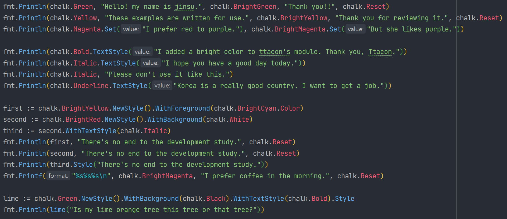
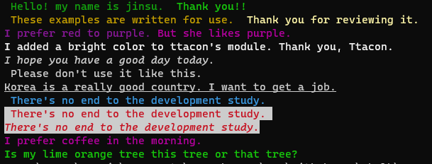

# Chalk

> Package chalk https://github.com/ttacon/chalk
> Copyright (c) 2014 Trey Tacon
> The MIT License (MIT)

- ttacon 의  chalk  모듈을 기반으로 제작된 패키지 입니다.

## Examples





- 추가 사항

  ```go
  BrightBlack   = BrightColor{Black}
  BrightRed     = BrightColor{Red}
  BrightGreen   = BrightColor{Green}
  BrightYellow  = BrightColor{Yellow}
  BrightBlue    = BrightColor{Blue}
  BrightMagenta = BrightColor{Magenta}
  BrightCyan    = BrightColor{Cyan}
  BrightWhite   = BrightColor{White}
  ```

- 변경 사항

  - Color 함수를 Color 클래스와 겹칠 우려가 있어 Set으로 변경하였다

  ```go
  func (c Color) Set(value string) string {
  	return fmt.Sprintf("%s%s%s", c, value, ResetColor)
      
  func (bc BrightColor) Set(value string) string {
  	return fmt.Sprintf("%s%s%s", bc, value, ResetColor)
  }
  ```

  

